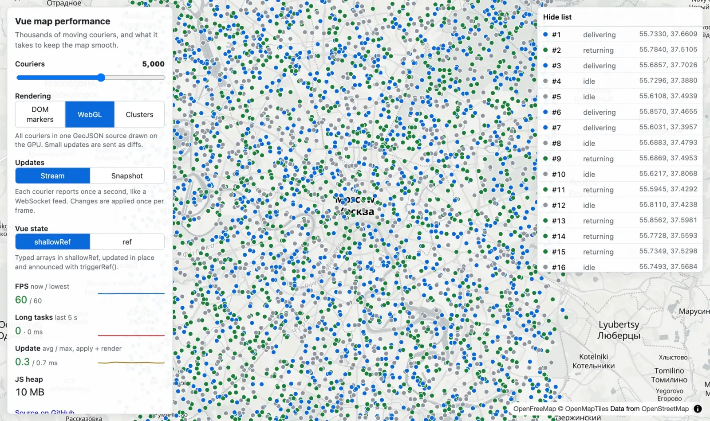

# Vue map performance

[](https://github.com/webn00b/vue-map-performance/actions/workflows/ci.yml)

Thousands of couriers moving on a map in Vue 3, with live numbers for what keeps it smooth: how the state is stored, how the markers are drawn and how updates arrive.

**[Open the demo](https://webn00b.github.io/vue-map-performance/)**



## What you can switch

| Setting   | Options                                   | What it shows                                                                     |
| --------- | ----------------------------------------- | --------------------------------------------------------------------------------- |
| Couriers  | 100 – 200,000                             | Where each approach stops scaling                                                 |
| Rendering | DOM markers, GeoJSON, clusters, GPU layer | HTML elements vs a GeoJSON source MapLibre re-tiles vs a custom WebGL layer       |
| Markers   | icons, dots                               | Vehicle icons with a heading arrow vs plain circles in the status color           |
| Updates   | stream, snapshot                          | Per-courier updates once a second (like WebSocket) vs the whole fleet (polling)   |
| Vue state | `shallowRef`, `ref`                       | Typed arrays updated in place vs an array of reactive objects with a deep watcher |

Every combination is a link, for example [50,000 couriers in a GeoJSON layer](https://webn00b.github.io/vue-map-performance/?n=50000&render=webgl), [200,000 on the GPU layer](https://webn00b.github.io/vue-map-performance/?n=200000) or [10,000 with a deep `ref`](https://webn00b.github.io/vue-map-performance/?n=10000&state=deep). DOM markers are capped at 10,000, GeoJSON layers and the deep `ref` at 50,000; above that the demo switches to the GPU layer and `shallowRef`.

## Numbers

`npm run bench` opens every scenario in headless Chromium on the GPU (Apple M3 Pro), waits 5 seconds and then measures for 10 seconds while dragging the map around. 10,000 couriers in stream mode with icons unless noted.

| Scenario                      | FPS (lowest) | Map updates / feed messages, per s | Long tasks, ms per 5 s | Update avg / max, ms |
| ----------------------------- | ------------ | ---------------------------------- | ---------------------- | -------------------- |
| GPU layer, `shallowRef`       | 60 (60)      | 10 / 10                            | 0                      | 0.3 / 0.4            |
| GPU layer, `ref`              | 50 (49)      | 10 / 10                            | 0                      | 41.4 / 47.9          |
| GeoJSON, `shallowRef`         | 60 (59)      | 10 / 10                            | 0                      | 0.4 / 0.8            |
| GeoJSON, `ref`                | 19 (17)      | 10 / 10                            | 3654                   | 50.8 / 57.8          |
| Clusters, `shallowRef`        | 60 (60)      | 10 / 10                            | 0                      | 0.7 / 1.0            |
| DOM markers, `shallowRef`     | 12 (12)      | 9 / 9                              | 4656                   | 3.2 / 7.6            |
| DOM markers, `ref`            | 8 (7)        | 7 / 10                             | 4795                   | 58.8 / 62.6          |
| 50k, GPU layer, `shallowRef`  | 60 (60)      | 10 / 10                            | 0                      | 1.0 / 1.2            |
| 50k, GeoJSON, `shallowRef`    | 42 (29)      | **0 / 10**                         | 426                    | 6.2 / 10.8           |
| 50k, GeoJSON, `ref`           | 2 (2)        | 2 / 10                             | 4460                   | 239.3 / 246.3        |
| 200k, GPU layer, `shallowRef` | 59 (59)      | 10 / 10                            | 0                      | 1.9 / 2.8            |

"Map updates" counts how often new courier data actually reached the screen. "Update" is the time from applying a batch of changes until Vue has flushed and the map layer has been updated; what MapLibre does in its own worker afterwards is not included.

Icons against plain dots (`npm run bench -- --dots`), FPS with the lowest in brackets, both runs back to back. The GPU rows are there for contrast; the other scenarios (clusters, DOM markers, the GPU layer and GeoJSON with `shallowRef` at 10,000) came out the same within noise.

| Scenario                      | Icons   | Dots    |
| ----------------------------- | ------- | ------- |
| GeoJSON, `ref`                | 19 (17) | 38 (33) |
| 50k, GeoJSON, `shallowRef`    | 42 (29) | 58 (57) |
| 50k, GPU layer, `shallowRef`  | 60 (60) | 60 (60) |
| 200k, GPU layer, `shallowRef` | 59 (59) | 60 (60) |

Runs vary: rows where the main thread is saturated can move by 10 FPS between runs.

What stands out:

- **FPS doesn't tell you the map is behind.** At 50,000 couriers at most one update in ten reaches the screen from the GeoJSON layer: MapLibre re-tiles the whole source in its worker after each update and can't keep up. Positions on screen are about a second old.
- **A custom WebGL layer removes that step.** Positions go from typed arrays straight into a GPU buffer, so every update is drawn on the next frame: 10 updates a second at 60 FPS with 200,000 couriers, and no long tasks.
- **Icons are free on the GPU, not in a symbol layer.** At 50,000 couriers the GeoJSON layer holds 58 FPS with a circle layer and 42, dipping to 29, with the same couriers as icons in a symbol layer. Rotating a heading arrow with `icon-rotate` in a second layer took it down to 16, so the GeoJSON layer uses one image per direction (16 of them) instead. The GPU layer samples a sprite atlas in the shader at the exact heading and runs at 60 FPS either way, even at 200,000. [Try dots](https://webn00b.github.io/vue-map-performance/?n=50000&render=webgl&markers=dots) vs [icons](https://webn00b.github.io/vue-map-performance/?n=50000&render=webgl) yourself.
- **`ref` vs `shallowRef` is a 50–100× difference per update.** With `ref`, every courier is a reactive proxy and the deep watcher walks all of them on every change. With `shallowRef`, Vue tracks one reference and the renderers get the list of couriers that moved.
- **DOM markers don't scale, whatever the state looks like.** The browser repositions every element on each frame of a map move.

## How it works

- **Simulation** runs in a Web Worker with a seeded PRNG, so the same settings always produce the same movement. Positions live in typed arrays and are transferred to the page without copying.
- **Stream mode** sends only the couriers that reported in the last tick; the page applies everything that arrived once per animation frame. **Snapshot mode** sends the whole fleet every few seconds.
- **State** is held either as an array of objects in `ref()` with a deep watcher, the way it is usually written, or as typed arrays in `shallowRef()` updated in place and announced with `triggerRef()`.
- **Icons** are [Lucide](https://lucide.dev) glyphs for the vehicle (bike, scooter, car) on a badge in the status color, with an arrow showing the direction of travel. They are drawn once into canvases at the screen's pixel ratio and reused by every mode: as `` sources for DOM markers, as MapLibre images for GeoJSON, and as a texture atlas for the GPU layer. The map stays north-up, since headings are drawn relative to the screen. The Markers switch replaces them with plain circles: a circle layer for GeoJSON, a CSS dot for DOM and a few lines of shader math for the GPU layer.
- **Rendering**: DOM mode uses one `maplibregl.Marker` per courier. GeoJSON mode keeps everyone in a single GeoJSON source and sends small stream updates through `updateData` with the changed features only; cluster mode uses the source's built-in clustering. The GPU layer is a MapLibre custom layer: positions are converted to Web Mercator into a `Float32Array`, uploaded with `bufferSubData` and drawn as point sprites by a small shader, with no GeoJSON or worker involved.
- **Metrics** come from `requestAnimationFrame` (FPS), `PerformanceObserver` (long tasks) and `performance.memory` (Chromium only). Map updates are counted when data reaches the screen: after each DOM update, on MapLibre's `sourcedata` event for GeoJSON, and when the GPU layer uploads a new buffer.

## Run it

```sh
npm install
npm run dev
```

```sh
npm test            # unit tests
npm run test:e2e    # Playwright smoke tests
npm run bench       # the table above; add -- --dots for plain dots
```

`npm run bench` passes `--use-angle=metal` to get the GPU in headless Chromium on macOS. Elsewhere, change the flags in `scripts/bench.mjs`, otherwise WebGL falls back to software rendering and the numbers mean little.

## Background

I've dealt with the same problems at work on Yandex Maps. This is a clean-room version on open data: MapLibre GL with [OpenFreeMap](https://openfreemap.org) tiles, no API key needed.

## License

MIT. Map data © [OpenStreetMap](https://www.openstreetmap.org/copyright) contributors, tiles by OpenFreeMap and OpenMapTiles. Vehicle icons from [Lucide](https://lucide.dev) (ISC).
